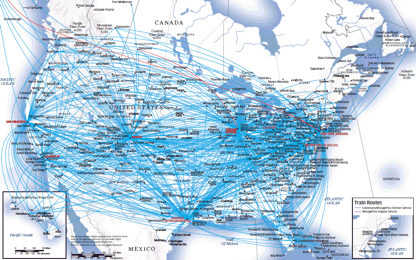

# PROJECT 2 // GROUP 2

# DATA FLYING

## Group 2 
   *  Lisa Hu 
   *  Zelalem Kebede
   *  Alex Koynoff    
   *  Stephen Monteiro    

## GOALS: 

* To analyze a dataset of flights for 2015, including volume of flights by airport, number of delays, coordinates of airports, delays,  etc. Create a dashboard to show analytics of the data such as average delay for each month/day, origin/destination. Also, create a map showing the busiest airports based on the 2015 dataset (top 10-20 airports). We chose this topic as it will allow us to analyze various trends from millions of flights for a full year (2015), and create an interactive dashboard that shows maps and statistics. Maps are very relevant with flying, so it felt like a good fit.

## Following the ETL process:

*  Extract: obtain the data from a CSV file found on Keggle.

*  Transform: review the CSV file in Pandas and clean the data as needed. Also, set up code for loading to MySQL, set up Flask app, and prep JavaScript files for graphical visualization (Plotly, Leaflet)

*  Load: load the data in MySQL via SQLAlchemy and also display the webpage (deploy to Heroku).

*  If time allows, create a web scraping function to get current flight prices based on the destination selected in dashboard webpage. Display results on the dashboard.

## DATA SOURCES: 

*  Core file: [2015 historical flight data](https://www.kaggle.com/freddejn/flights#flights.csv)

## Programming Languages to be used:

   *   Python 
   *   SQL
   *   HTML/CSS Bootstrap
   *   FLASK RESTful API
   *   Javascript
   *   Plotly.js
   *   Leaflet.js

## Please see the photo below for a quick sketch of what our INTERACTIVE WEB DASHBOARD will look like.

## Images that gave us “inspiration”

- - -

### Copyright

Data Boot Camp © 2018. All Rights Reserved.
